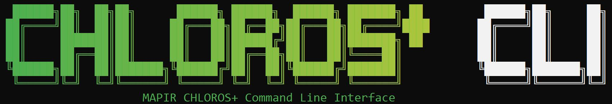

# Başlangıç

<figure><figcaption></figcaption></figure>
Chloros, [MAPIR](https://www.mapir.camera) tarafından görüntüleri ve diğer sensör verilerini işlemek için geliştirilmiş bir yazılım uygulamasıdır.

***

Chloros, 3 uygulama modunda kullanılabilir:

## Chloros: Masaüstü GUI uygulaması

Tüm özelliklere sahip bağımsız ayrı pencere.

## [Chloros CLI: Komut satırı arayüzü](CLI.md)

Komut satırı toplu işleme. Otomasyon, komut dosyası oluşturma ve gelişmiş iş akışları için mükemmeldir. _CLI&#x27;ye erişmek için Chloros+ lisansı gerekir._

## [Chloros API: Python SDK](api-python-sdk.md)

Otomasyon ve özel iş akışları için programlı Python arayüzü. Araştırma süreçleri, mevcut Python uygulamalarıyla entegrasyon ve özel araçlar oluşturmak için mükemmeldir. _API&#x27;ye erişmek için Chloros+ lisansı gerekir._

***

## Chloros+

Chloros çoğu görev için ücretsiz olarak kullanılabilir, ancak daha fazlasını isteyebilirsiniz. İşte bu noktada Chloros+ için ücretli lisans size fayda sağlayabilir. Chloros+ lisansı ile aşağıdaki gibi yeni özelliklerin kilidini açabilirsiniz:

* **Çok İş Parçacıklı İşleme**: Görüntüleri boru hattı üzerinden eşzamanlı olarak işleyerek büyük projeler için görüntü işlemeyi büyük ölçüde hızlandırın.
* **GPU (CUDA) Hızlandırma**: Günümüzün daha yüksek GPU bellek seçeneklerinden yararlanarak görüntü işleme boru hattını daha da hızlandırın. En iyi sonuçlar için 4 GB veya daha fazla VRAM öneririz.
* **Chloros+**[**CLI**](CLI.md)**Erişim**: Chloros+&#x27;ı komut satırından çalıştırarak otomatikleştirin ve kendi yazılımınıza entegre edin.
* **Chloros+**[**API**](api-python-sdk.md)**Erişim:** programlı kontrol için Python&#x27;ten Chloros+&#x27;ı çalıştırın, böylece araştırma süreçleriniz, veri analizi iş akışlarınız ve özel uygulamalarınızla sorunsuz entegrasyon sağlayın.
* **Birden Fazla Cihaz Kullanımı**: her Chloros+ lisansı 2&#x27;den fazla cihazın kaydedilmesine izin verir. MAPIR Cloud hesabınızı kullanarak kayıtlı cihazları yönetin. Chloros+ lisansınızı yükseltin ve daha fazla cihaz için destek ekleyin.
* **Gelişmiş Doku Duyarlı Debayer Yöntemi:** neredeyse tüm debayering gürültüsünü ortadan kaldıran bir AI/ML gürültü giderme modeli ile birleştirilmiş yüksek kaliteli kenar duyarlı debayer.
* **Özel Multispektral İndeks Formülleri:** hem işleme hem de görüntü görüntüleme sanal alanı için Chloros raster hesaplayıcılara özel multispektral indeksler girin.

<a href="https://cloud.mapir.camera/pricing" class="button primary" data-icon="envira">Chloros+ Fiyatlandırma ve Kayıt</a>

<figure><figcaption></figcaption></figure>

<figure><figcaption></figcaption></figure>

<figure><figcaption></figcaption></figure>

<figure><figcaption></figcaption></figure>

<figure><figcaption></figcaption></figure>

<figure><figcaption></figcaption></figure>
