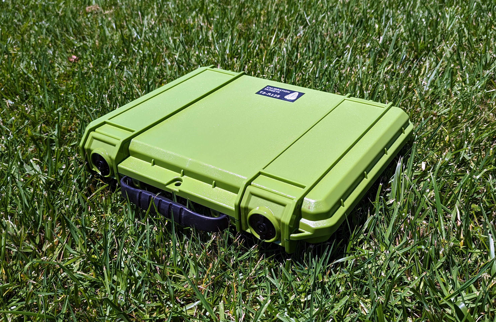

# Kalibrasyon Hedefleri

MAPIR, çeşitli uygulamaları kapsayan farklı kalibrasyon hedefleri sunmaktadır. Aşağıda görülen kompakt T4-R50 modeli, 250 - 2.500 nm aralığında ışık yansıtma değeri ölçülmüş 4 panel içermektedir.

<figure><figcaption>
MAPIR T4-R50
</figcaption></figure>T4 dağınık referans hedefleri aşağıdaki yansıma eğrilerine sahiptir, [verileri buradan indirebilirsiniz](https://cdn.shopify.com/s/files/1/0972/5566/files/MAPIR_Diffuse_Reflectance_Standard_Calibration_Target_Data_T4.xlsx?v=1741759157):

<figure><figcaption>
MAPIR T4 Yansıma :: 250-2500 nm
</figcaption></figure>

<figure><figcaption>
MAPIR T4 Yansıma :: 400-1000 nm
</figcaption></figure>T4P dağınık referans hedefleri aşağıdaki yansıma eğrilerine sahiptir, [verileri buradan indirebilirsiniz](https://cdn.shopify.com/s/files/1/0972/5566/files/MAPIR_Diffuse_Reflectance_Standard_Calibration_Target_Data_T4.xlsx?v=1741759157):

<figure><figcaption>
MAPIR T4P Yansıma :: 250-2500nm
</figcaption></figure>

<figure><figcaption>
MAPIR T4P Yansıma :: 400-1000nm
</figcaption></figure>Yansıma grafiğine baktığınızda, değerlerin dalga boyu (x ekseni) ile yansıma yüzdesi (y ekseni) arasında bir ilişki olduğunu görebilirsiniz. Kalibrasyon hedefinin bir görüntüsünü yakaladığımızda, kameranın her bir sensör bandının duyarlı olduğu spektrum içinde piksel değeri ile yansıma yüzdesi arasında bir ilişki oluştururuz.

Bu, kameralarımızla çektiğiniz her görüntüde, [T4-R50](https://www.mapir.camera/collections/calibration-targets/products/diffuse-reflectance-standard-calibration-target-package-t3-r50) veya [T4-R125](https://www.mapir.camera/collections/multispectral-reflectance-reference-calibration-targets/products/diffuse-reflectance-standard-calibration-target-package-t4-r125) gibi yansıma hedeflerimizin bir fotoğrafını kullanarak görüntüleri yansıma açısından kalibre edebileceğiniz anlamına gelir. Kalibrasyon yapıldıktan sonra, görüntüdeki her piksel yüzde yansıma değerine eşittir.

Chloros&#x27;teki kalibre edilmiş görüntüleri tipik JPG veya TIFF olarak çıkarırsanız, yansıma yüzdesi piksel değerinin görüntü formatının bit derinliğine bölünmesiyle hesaplanır. Yani JPG için 255&#x27;e, TIFF için ise 65.535&#x27;e bölün. Ayrıca, Chloros&#x27;te PERCENT formatını seçebilirsiniz; bu durumda her piksel 0,0 ile 1,0 arasındaki bir yüzde değerine sahip olacaktır (yansıtma oranı %0 ile %100 arasında). Bazı görüntü uygulamalarının yüzde (kayan nokta) görüntüleri kabul edemediğini ve bu görüntülerin depolama açısından boyutlarının büyük olduğunu unutmayın.

<figure><figcaption>
T4-R125
</figcaption></figure> <figure><figcaption>
T4-R125
</figcaption></figure> <figure><figcaption>
T4-R125
</figcaption></figure>

