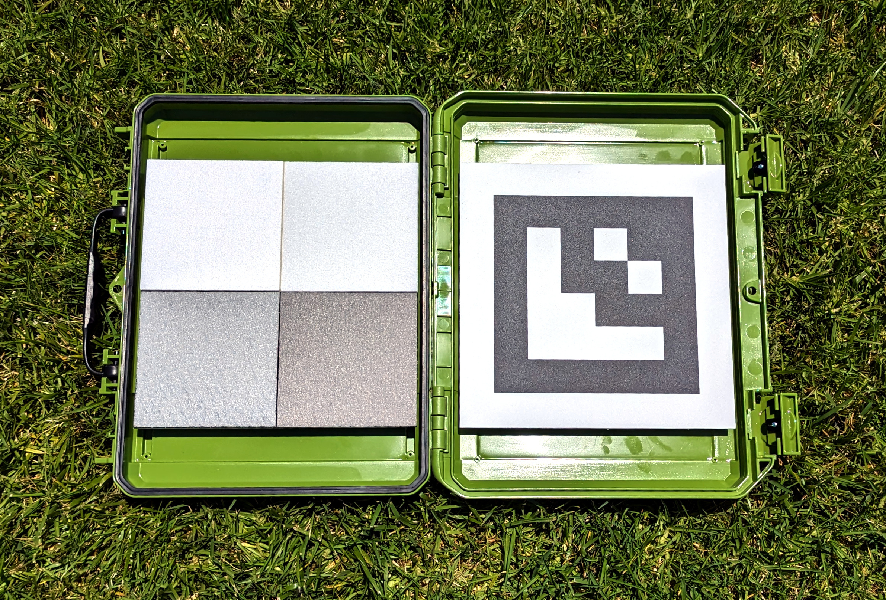

# Kalibrasyon Hedefleri

MAPIR, çeşitli uygulamaları kapsayan farklı kalibrasyon hedefleri sunar. Aşağıda görülen kompakt T4-R50, 250 - 2.500 nm aralığında ışık yansıma değeri ölçülmüş 4 panel içerir.

<figure><figcaption>
MAPIR T4-R50
</figcaption></figure>T4 dağınık referans hedefleri aşağıdaki yansıma eğrilerine sahiptir, [verileri buradan indirebilirsiniz](https://cdn.shopify.com/s/files/1/0972/5566/files/MAPIR_Diffuse_Reflectance_Standard_Calibration_Target_Data_T4.xlsx?v=1741759157):

<figure><figcaption>
MAPIR T4 Yansıma Oranı :: 250-2500 nm
</figcaption></figure>

<figure><figcaption>
MAPIR T4 Yansıtma :: 400-1000 nm
</figcaption></figure>T4P dağınık referans hedefleri aşağıdaki yansıma eğrilerine sahiptir, [verileri buradan indirebilirsiniz](https://cdn.shopify.com/s/files/1/0972/5566/files/MAPIR_Diffuse_Reflectance_Standard_Calibration_Target_Data_T4.xlsx?v=1741759157):

<figure><figcaption>
MAPIR T4P Yansıma Oranı :: 250-2500 nm
</figcaption></figure>

<figure><figcaption>
MAPIR T4P Yansıtma Oranı :: 400-1000 nm
</figcaption></figure>Yansıma grafiğine baktığınızda, değerlerin dalga boyu (x ekseni) ile yansıma yüzdesi (y ekseni) arasında bir ilişki olduğunu görebilirsiniz. Kalibrasyon hedefinin bir görüntüsünü yakaladığımızda, kameranın her bir sensör bandının duyarlı olduğu spektrum içinde piksel değeri ile yansıma yüzdesi arasında bir ilişki oluştururuz.

Bu, kameralarımızla çektiğiniz her görüntüde, [T4-R50](https://www.mapir.camera/collections/calibration-targets/products/diffuse-reflectance-standard-calibration-target-package-t3-r50) veya [T4-R125](https://www.mapir.camera/collections/multispectral-reflectance-reference-calibration-targets/products/diffuse-reflectance-standard-calibration-target-package-t4-r125) gibi bir fotoğrafını kullanarak görüntüleri yansıtma açısından kalibre edebilirsiniz. Kalibrasyon tamamlandığında, görüntüdeki her piksel yüzde yansıtma değerine eşittir.

**Survey3** çıktıları için, Chloros&#x27;te kalibre edilmiş görüntüleri standart JPG veya TIFF formatında dışa aktarırsanız, yansıma yüzdesi piksel değerinin görüntü formatının bit derinliğine bölünmesiyle hesaplanır. Yani JPG için 255&#x27;e, TIFF için ise 65.535&#x27;e bölün. Ayrıca Chloros&#x27;te PERCENT formatında çıktı seçeneğini de tercih edebilirsiniz; bu durumda her piksel 0,0 ile 1,0 arasındaki bir yüzde değerinde (yansıtma oranı %0 ile %100 arası) olacaktır. Bazı görüntü uygulamalarının yüzde (kayan nokta) formatındaki görüntüleri kabul edemediğini ve bu tür dosyaların depolama açısından büyük boyutlu olduğunu unutmayın.


**LATTICE yansıma değeri farklı bir piksel ölçeği kullanır.** LATTICE yansıma değeri, DN 32768 = %100 yansıma (65535 değil) olarak kaydedilir ve her dosya, ölçeğini belirten bir XMP `Chloros:PixelScale` etiketi taşır. Sabit bir değer varsaymak yerine etiketi okuyun ve bu değere bölün — bkz. [Çıktı Görüntü Formatları](output-image-formats.md).


## LATTICE kameralarla kalibrasyon hedefleri

LATTICE kameralarda yansıma için bir kalibrasyon hedefi **isteğe bağlıdır**: Chloros bunun yerine, bir DAQ ışık sensörü tarafından ölçülen aşağı doğru ışınım yoğunluğuna (ρ = π·L/E) göre yansıma değerini referans alabilir. Referans, yansıma kaynağı ayarıyla seçilir (GUI&#x27;deki Proje Ayarları; `--reflectance-source`, CLI içinde; `reflectance_source`, SDK içinde) seçilir:

| Değer | Davranış |
| --- | --- |
| `auto` *(varsayılan)* | Kalite kontrolünden geçen çerçeve içi hedef **mutlak referans** olarak kabul edilir; hedef bulunmadığında veya kalite kontrol başarısız olduğunda, Chloros, DAQ aşağı yönlü bölünmesine geri döner. |
| `target` | Yalnızca hedef odaklı — DAQ ikamesi yok. |
| `daq` | DAQ öncelikli — aşağı doğru ölçüm her zaman referans olarak kullanılır. |

LATTICE için ek hedef davranışları:

* **Hedef geometrileri** — ArUco ile işaretlenmiş paneller, sabit ROI panelleri ve şerit hedeflerin tümü desteklenir; geometri, projenin hedef yapılandırmasından alınır.
* **Birim başına ölçülmüş hedef verileri** — `--target-reflectance-dir DIR`, birim başına ölçülmüş hedef yansıma taramalarının bulunduğu bir dizine işaret eder (`<serial>.csv`, hedef birimin seri numarası/QR kodu ile aranır). Hedef bulunamadığında, Chloros nominal T3/T4P spektrumlarına geri döner.
* **Zamansal sabitleme** — algılanan bir hedef, çevresindeki kareleri kalibre eder ve hedef gözlemleri arasında sabit tutulur.

Bayrakların tam anlamları ve örnekleri [CLI Referansı](reference/cli-reference.md) içinde bulunur (bkz. &quot;Ürün Bazında Dışa Aktarma Anahtarları&quot;).

### F988

&quot;F988 yansıma değeri, sahne içi bir yansıma paneli kullanılarak kalibre edilir: bant, DAQ ışık sensörünün kalibre edilmiş aralığının ötesinde yer aldığından, Chloros en son panel yakalamanızı uygular ve panel gözlemleri arasında bunu korur.&quot;

F988, yalnızca DAQ kalibrasyonu ile çalıştırılırsa, Chloros o bant için DAQ tabanlı yansıma değerini reddeder ve nedenini belirtir (atlama nedeni `dls-uncalibrated-band-988`); panel iş akışı desteklenen yoldur.

<figure><figcaption>
T4-R125
</figcaption></figure> <figure><figcaption>
T4-R125
</figcaption></figure> <figure><figcaption>
T4-R125
</figcaption></figure>

