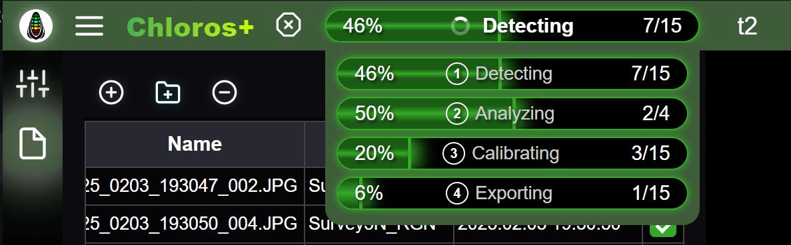

# GUI: Gezinme

Chloros ve Chloros (Tarayıcı) uygulamalarını ilk kez başlattığınızda, arka uç işlemleri başlatılır. Hazır olduğunda sol üstteki ana menü simgesi görünür hale gelir  .

<figure><figcaption></figcaption></figure>

Sol sağdan sağa doğru üst başlık şunları içerir:

###  Ana Menü

<figure><figcaption></figcaption></figure>

Ana menüden şunları yapabilirsiniz:

* **Yeni Proje** — yeni bir proje oluşturun
* **Projeyi Aç** — mevcut bir projeyi açın
* **Proje Klasörünü Aç** — dosya gezgininde proje klasörünü açın
* **Dosya Ekle** — mevcut projeye tek tek görüntü dosyaları ekleyin _(proje açıldıktan sonra görünür)_
* **Klasör Ekle** — mevcut projeye bir resim klasörü ekleyin _(proje açıldıktan sonra görünür)_
* **İşlemeyi Başlat / İşlemeyi Durdur** — resim işleme sürecini başlatın veya durdurun _(dosyalar eklendikten sonra etkinleştirilir)_


**Yalnızca Windows**: Chloros Masaüstü GUI&#x27;si, Windows&#x27;te mevcuttur. Linux kullanıcıları, [CLI](CLI.md) ve [Python SDK](api-python-sdk.md) belgelerine bakmalıdır.


###  Oynat/Başlat Düğmesi

Etkinleştirildiğinde, işleme başlat düğmesi görüntü işleme boru hattını başlatır.

###  İlerleme Çubuğu Tüm dosyaları sırayla işleyen ücretsiz Chloros modunda, ilerleme çubuğu 2 aşamayı gösterir: Hedef Algılama ve İşleme.

Tüm dosyaları aynı anda işleyen ücretli Chloros+ lisanslı modunda, ilerleme çubuğu 4 aşamayı gösterir: Algılama, Analiz, Kalibrasyon, Dışa Aktarma. Fare imlecini Chloros+ ilerleme çubuğunun üzerine getirdiğinizde, ilerlemeyi takip edebilmeniz için genişletilmiş 4 aşamalı ilerleme çubuğu paneli açılır. Üstteki ilerleme çubuğuna tıkladığınızda açılır panel dondurulur, tekrar tıkladığınızda ise dondurma kaldırılır.

<figure><figcaption></figcaption></figure>

## Yan Menü

Sol kenar çubuğu menüsü, etkileşim kurabileceğiniz çeşitli simgeler içerir:

####  [Proje Ayarları](project-settings/project-settings.md)

Proje Ayarları sekmesi, proje genel ayarlarını ve proje işleme ayarlarını düzenlemenizi sağlar. Dosyalarınızı işlemeye başlamadan önce bu ayarları düzenleyin.

####  Dosya Tarayıcı

Projeye dosya/klasör ekleyin ve projeden dosya kaldırın. Çift dosyalar yok sayılır. Hedef görüntü için hedef sütun kutusunu işaretleyin; işleme, hedefler için yalnızca işaretli görüntüleri inceleyecek ve işleme sürenizi büyük ölçüde hızlandıracaktır. Görüntü/Meta Veri düğmesini kullanarak, seçilen görüntünün küçük resim ızgarasını görüntülemek ile ayrıntılı meta veri tablosunu görüntülemek arasında geçiş yapabilirsiniz.

####  [Görüntü Görüntüleyici](image-viewer-gui/opening-an-image-full-screen.md)

Ana görüntü görüntüleyicide bir görüntüye tıklandığında, Görüntü Görüntüleyici sekmesinde tam ekran olarak açılır.

####  [Harita](image-viewer-gui/map-markers.md)

Görüntülerinizi GPS koordinatlarına göre etkileşimli bir 2D harita üzerinde görüntüleyin. Google Haritalar ve ESRI döşeme sağlayıcılarını destekler ve konumunuz için en uygun hizmeti otomatik olarak seçer. İşaretçilerin üzerine gelerek görüntü küçük resim önizlemelerini görebilirsiniz.

####  Hata Giderme Günlüğü

Sorun yaşandığında hata giderme çıktıları için günlüğü inceleyin. Günlüğü kopyalayın/indirin ve yardım almak için [MAPIR Destek](https://www.mapir.camera/community/contact) ekibine gönderin.

####  [Kullanıcı Girişi](chloros+-login.md)

Kullanıcı girişi kenar çubuğu, Chloros+ hesabınıza giriş yapmanızı ve gelişmiş özelliklerin kilidini açmanızı sağlar. Ayrıca, mevcut uygulama sürümünü görüntüleyebilir ve Chloros GUI ile CLI&#x27;te görüntülenen metnin dilini ayarlayabilirsiniz.
