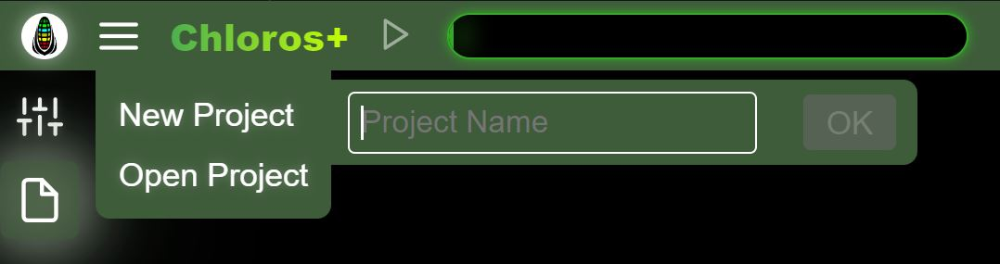

# GUI: Projeler

Chloros, ileride yeniden açılabilecek projeler oluşturmanıza olanak tanır.

## Yeni Proje

<figure><figcaption></figcaption></figure>Ana menüden &quot;Yeni Proje&quot;yi seçin ve projeniz için benzersiz bir ad girin.

## Projeyi Aç

<figure><figcaption></figcaption></figure>&quot;Proje Aç&quot; seçeneğini seçerek Proje Klasöründeki mevcut projelerin listesini görebilirsiniz. Eğer herhangi bir proje yoksa, ikincil yan menü açılmayacaktır. Yukarıdaki fotoğrafta listelenen bazı GUI tarafından oluşturulan projeleri (t1, t2, t3) görebilirsiniz. DATE\_TIME projeleri, CLI tarafından varsayılan proje adlandırma şeması kullanılarak oluşturulmuştur. Herhangi bir proje adına tıkladığınızda proje açılacaktır.

&quot;Proje Klasörünü Aç&quot; düğmesine tıkladığınızda, bilgisayarınızın dosya gezgini proje yolunda açılır. Proje yolunu [Proje Ayarları](project-settings/project-settings.md) bölümünden ayarlayabilirsiniz.

## Dosya Ekle

Bir proje açıldıktan sonra, ana menüden &quot;Dosya Ekle&quot;yi seçerek mevcut projeye tek tek görüntü dosyaları ekleyebilirsiniz. Bu, dosya gezgininin ekleme işlevini yansıtır, ancak kolaylık olması açısından doğrudan ana menüden erişilebilir.

## Klasör Ekle

Bir proje açıldıktan sonra, ana menüden &quot;Klasör Ekle&quot;yi seçerek mevcut projeye bir klasörün tamamındaki görüntüleri ekleyebilirsiniz. Yinelenen dosyalar göz ardı edilir.

## İşlemeyi Başlat / Durdur

Dosyalar bir projeye eklendikten sonra, ana menüde &quot;İşlemeyi Başlat&quot; seçeneği kullanılabilir hale gelir. Bu, üst başlıktaki Oynat/Başlat düğmesine tıklamakla aynı işlemdir. İşleme sırasında, iş akışını durdurabilmeniz için menü öğesi &quot;İşlemeyi Durdur&quot; olarak değişir.


Dosya Ekle, Klasör Ekle ve İşlemeyi Başlat/Durdur menü öğeleri, yalnızca bir proje açıkken ve dosyalar eklendiğinde görünür veya etkin hale gelir. Bu öğeler, Dosya Tarayıcı kenar çubuğu ve üst başlık düğmeleri aracılığıyla da kullanılabilen işlemlere hızlı erişim sağlar.

